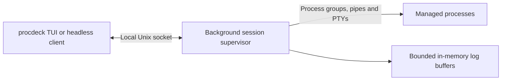

# Architecture

Process Deck targets local development on macOS. Its YAML schema and CLI are the public interfaces; the session protocol and packages under `internal/` are implementation details.

## Process ownership

The CLI discovers a session using the canonical working directory and configuration path. The first client validates the configuration and launches a copy of its own executable in a separate OS session, without inherited terminal I/O. The worker owns the supervisor and all managed process I/O. Subsequent clients attach to that worker without reloading configuration or changing its inherited environment.

This boundary keeps process control, PTY ownership, exit status collection, automatic restarts, and retained logs intact when the terminal client disappears. The worker itself is not crash-recoverable, and arbitrary existing processes cannot be adopted.

## Responsibilities

- `internal/config` loads and validates YAML.
- `internal/process` starts process groups, captures their output, and sends stop signals.
- `internal/supervisor` applies dependencies, restart policies, state transitions, and log retention.
- `internal/session` owns worker startup, session discovery, exclusive attachment, and local communication.
- `internal/tui` renders cached state and logs and sends explicit process commands. Snapshot reads use the client cache; history reads and process commands use separate socket connections so they do not depend on draining the event stream.

The worker always drains supervisor events, including when detached. Attached clients receive ordered events through bounded queues. Output bursts apply backpressure; a disconnected client or an expired socket write deadline releases that pressure. Reattachment restores only the history still retained by the supervisor.

## Lifetime and isolation

A lock inherited by the worker prevents competing launches from starting duplicate processes. The lock file remains after normal shutdown so concurrent openers cannot lock different files at the same path. An abandoned socket with no lock owner is treated as an unavailable supervisor, requiring cleanup of surviving processes before another session can start.

The socket lives in a short, owner-only directory under `/tmp` to fit macOS Unix socket path limits. Configuration is transferred through an inherited pipe, not persisted to a state file or passed as command-line arguments. Communication stays local and requires access to that directory. Protocol versions are checked before accepting commands.

Only an explicit quit, interrupt, termination request, or a headless session completing its workload ends the session. A session first started with the TUI remains available after all processes exit, allowing manual starts. Closing a terminal connection leaves ownership with the worker. No system service is installed, and sessions do not survive a reboot.
